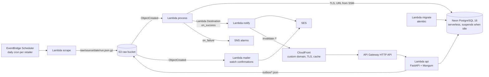

# PricePulse

Daily price tracking for IKEA US offers and the UNIQLO US catalog: real discounts measured against
90-day price history, with email alerts.

**Live: [pricepulse.hoangmnguyen.com](https://pricepulse.hoangmnguyen.com)** · [API docs](https://pricepulse.hoangmnguyen.com/docs)


## What it does

- Checks every IKEA US offer and every last-chance item, and the full UNIQLO US catalog, once a
  day and keeps the price history.
- Measures discounts against each product's own 90-day history, not only against what the retailer
  claims. UNIQLO publishes no list price — only a "sale" flag, and the regular price only when a
  style's clearance colours are split into their own price group — so its percentage off usually
  comes from history, and shows `0 %` until a product has been seen more than once.
- Shows what is actually left to buy: for UNIQLO, which sizes are in stock per colour (click a
  swatch on the product page) and a "Size" filter on the deals page (`?size=M`); plus availability
  labels for both retailers — last chance, in-store only, XL stores only, online only, select
  colours/sizes, coming soon — filterable with `?label=`.
- Pick a retailer on the landing page, then a page with columns that fit it: IKEA shows list
  price, tag and offer end date; UNIQLO shows the usual price, the 90-day low and the sale flag.
  Sort, filter, search and share any view by URL; every product has a page with its price chart.
- Watch a product by email: double opt-in, a per-product threshold, and one-click unsubscribe.
- A product that leaves a retailer's feed leaves the deals list the same day; its page and history
  stay reachable.


## Data & privacy

- Scraping stores product metadata (name, category, URL, image URL) and prices — no reviews, no
  image files, no personal data.
- A watch stores the email address, the product and the threshold. Unconfirmed watches are purged
  by the operator after 30 days ([runbook](docs/RUNBOOK.md#watches)).
- Every alert to a watcher carries an unsubscribe link and the `List-Unsubscribe` /
  `List-Unsubscribe-Post` headers (RFC 8058). Confirmation and unsubscribe links show a page and act
  only on the button press, so a mail scanner cannot confirm or unsubscribe on your behalf.
- The adapters honour `robots.txt` (UNIQLO's disallowed filter parameters are never sent), identify
  themselves as `User-Agent: pricepulse/0.1`, make ~40 requests a day in total, pause 500 ms after
  every request, and retry at most 3 times with exponential backoff on connection errors, 429 and
  500/502/503/504. Details in [ADR-0007](docs/adr/0007-respecting-robots-and-rate-limits.md).

## Run locally

Prerequisites: [`uv`](https://docs.astral.sh/uv/), Docker with the compose plugin, `make`; `psql`
is optional. No AWS account needed.

```bash
cp .env.example .env
make up migrate            # Postgres 16 via docker compose on :5433, alembic upgrade head
uv run pricepulse run --source ikea     # scrape -> data/raw -> Postgres, prints alerts as JSON
uv run pricepulse run --source uniqlo
make serve                 # http://localhost:8000  (dashboard)  http://localhost:8000/docs (OpenAPI)
```

```bash
curl -s 'localhost:8000/v1/deals?min_discount=30&limit=3' | jq .
curl -s 'localhost:8000/v1/products/2/history?days=90' | jq .
curl -s 'localhost:8000/v1/deals?sort=savings&category=Storage%20%26%20organization&max_price=50' | jq .total
curl -s -X POST localhost:8000/v1/watches -H 'content-type: application/json' \
     -d '{"product_id": 2, "email": "you@example.com", "min_discount_pct": 10}'   # 202 -> data/raw/outbox/...
uv run pricepulse mailer --key outbox/watch_confirm/<date>/<id>.json --dry-run     # the confirmation email
uv run pricepulse notify --key-json result.json --dry-run   # render the email digest
make test-unit             # pytest without Postgres
make lint test             # ruff + pytest (unit + Postgres integration)
```

## Architecture



- **No VPC, no NAT, no always-on database.** The database is Neon (serverless PostgreSQL,
  ≈ 1 s resume, $0); every function runs outside a VPC. Chosen after measuring Aurora
  Serverless v2's 5–15 s resume on the first deployment. ([ADR-0009](docs/adr/0009-neon-instead-of-aurora.md))
- **Least privilege, secrets out of code.** Three DB roles (`app_migrator` / `app_rw` / `app_ro`);
  DDL-ish needs of the app role go through `SECURITY DEFINER` helpers; each Lambda reads only its
  own connection URL from an SSM SecureString parameter. ([ADR-0004](docs/adr/0004-partitioning-and-materialized-summary.md))
- **Idempotent, retryable ETL.** Raw payloads are the source of truth (S3, gzip JSON). Processing
  is keyed on the object key: re-delivering an event is a no-op; a failed run — including a failed
  summary refresh — is retried once by Lambda and yields the same alerts.
- **History-derived discounts.** `discount_pct` is computed against the 90-day mode of prior
  observations when the retailer publishes no list price, uniformly for both retailers.
  ([ADR-0005](docs/adr/0005-history-derived-discount-and-single-db-role-for-api.md))
- **Cache in front, not a bigger database.** Pages set `Cache-Control: s-maxage=86400`; CloudFront
  serves them and `notify` invalidates `/*` after each run, so visitors almost never wake the
  database. Watch/confirm routes bypass the cache. ([ADR-0010](docs/adr/0010-public-watches-and-cdn.md))
- **Strict CSP, no inline scripts.** Page CSS/JS are static files under `/static/`; CDN libraries
  are SRI-pinned; the policy has no `'unsafe-inline'`.
- **Data-driven retailers.** Adapters carry their own metadata and register their `source` row on
  the first run; adding a retailer is one adapter plus one Terraform map entry
  ([how](docs/architecture.md#adding-a-retailer)).

More: [architecture.md](docs/architecture.md) · [ADRs](docs/adr) · [runbook](docs/RUNBOOK.md)

## Deploy to AWS

Prerequisites: an AWS account, `aws login`, a [Neon](https://neon.com) account (Free plan) with a
personal API key exported as `NEON_API_KEY` and its organization id in `dev.auto.tfvars`
(`neon_org_id`, from Organization settings), Terraform ≥ 1.10, `uv`, `psql`.

```bash
terraform -chdir=infra/bootstrap init && terraform -chdir=infra/bootstrap apply   # state bucket
scripts/build_lambda.sh                                                           # build/*.zip (arm64, reproducible)
terraform -chdir=infra/envs/dev init -backend-config="bucket=$(terraform -chdir=infra/bootstrap output -raw state_bucket)"
terraform -chdir=infra/envs/dev apply          # edit infra/envs/dev/dev.auto.tfvars first
# click the SES verification email(s) and confirm the SNS subscription
scripts/bootstrap_db.sh                        # least-privilege DB roles via psql (one time)
aws lambda invoke --function-name pricepulse-dev-migrate --cli-binary-format raw-in-base64-out --payload '{}' /dev/stdout
aws lambda invoke --function-name pricepulse-dev-scrape  --cli-binary-format raw-in-base64-out --payload '{"source":"ikea"}' /dev/stdout
terraform -chdir=infra/envs/dev output site_url  # https://<distribution>.cloudfront.net
```

Optional custom domain, in two applies: set `domain_name = "pricepulse.example.com"` in
`dev.auto.tfvars` (a delegated subdomain works like an apex; add `hosted_zone_id` if the zone
already exists), `apply`, and create NS records for that name at the parent's DNS host from
`terraform -chdir=infra/envs/dev output name_servers`. Once `dig NS pricepulse.example.com`
answers, set `domain_attached = true` and `apply` again: ACM validates through the zone and
CloudFront gets the alias. Until then `site_url` is the `*.cloudfront.net` hostname.

Email beyond your own verified addresses needs SES production access (otherwise the sandbox
rejects unverified recipients):

```bash
aws sesv2 put-account-details --production-access-enabled --mail-type TRANSACTIONAL \
  --website-url "$(terraform -chdir=infra/envs/dev output -raw site_url)" \
  --use-case-description "Personal price-tracking site; double opt-in watch confirmations and daily digests to confirmed subscribers; unsubscribe links in every email." \
  --additional-contact-email-addresses you@example.com --contact-language EN
```

(If the CLI rejects a flag, submit the same text through the SES console → Account dashboard →
Request production access. AWS answers within ~24 h.)

After that, GitHub Actions deploys `main` via OIDC (`AWS_DEPLOY_ROLE_ARN`, `TF_STATE_BUCKET` and
`NEON_API_KEY` repository secrets): a `plan` job publishes the Terraform plan in the run summary
and the `apply` job runs in the `dev` environment, which can require a reviewer. Dependabot keeps
Python, Terraform, and Actions dependencies current weekly.

Everything an operator needs afterwards is in [docs/RUNBOOK.md](docs/RUNBOOK.md): credentials
layout, AWS login, re-running a scrape or a failed key, watch administration, the CDN, SES, alarms,
DNS delegation, and tear-down.

## Cost

Estimated from the account's Cost Explorer and free-tier usage after the cutover (the account's
12-month free tiers have expired; only always-free allowances apply):

| Item | Basis | Monthly |
| --- | --- | --- |
| Route 53 hosted zone for the subdomain | $0.50/zone; alias queries to CloudFront are free | **$0.50** |
| API Gateway HTTP API | ~10k origin requests (cache misses + uncached routes) at $1/M | $0.01 |
| S3 raw + outbox | ~45 MB/month growth, 365-day retention, ≤ 0.5 GB at $0.023/GB | $0.01 |
| SES | ~60 digests + confirmations at $0.10/1k | $0.01 |
| Lambda | ~5k GB-s, ~15k invocations vs. always-free 400k GB-s / 1M | $0 |
| CloudFront + ACM | always-free 1 TB, 10M requests, 1,000 invalidation paths (≈ 60 used) | $0 |
| CloudWatch | 8 custom metrics / 6 alarms (10/10 free), ~50 MB logs (5 GB free) | $0 |
| EventBridge Scheduler, SNS, SSM + KMS, Budgets, data transfer | inside always-free allowances | $0 |
| Neon Free | ≈ 10–25 of 100 included CU-hours, 35 MB of 0.5 GB storage | $0 |
| **Total** | | **≈ $0.55** |

Before the move, Aurora Serverless v2 at 0–1 ACU alone cost ≈ $1–3/month and resumed in 5–15 s;
Neon resumes in ≈ 1 s ([ADR-0009](docs/adr/0009-neon-instead-of-aurora.md)). Cold path today:
Lambda init 2.5 s + first request ≈ 3 s; warm 0.1 s; CloudFront serves cached pages regardless.
A $5 AWS Budget with 80 %/100 % notifications guards the account.
`terraform -chdir=infra/envs/dev destroy` removes the stack, the Neon project included (empty the
raw bucket first, or set `force_destroy`); the state bucket lives in `infra/bootstrap` and is
destroyed separately.

## Engineering notes

- **Least-privilege roles end to end.** Per-function IAM policies scoped to one bucket prefix, one
  SSM parameter and one SNS topic; DB roles split into migrator / read-write / read-only, with the
  app role's DDL needs behind `SECURITY DEFINER` helpers.
  ([ADR-0004](docs/adr/0004-partitioning-and-materialized-summary.md), [ADR-0005](docs/adr/0005-history-derived-discount-and-single-db-role-for-api.md))
- **Idempotent, retryable ingestion.** Runs are claimed by object key; observations insert with
  `ON CONFLICT DO NOTHING`; alerts are computed against observations older than the payload, so a
  retry after a failed summary refresh produces the same digest instead of none.
  ([ADR-0003](docs/adr/0003-vpc-without-nat-and-lambda-destinations.md) for the Destinations chain)
- **PostgreSQL, not DynamoDB.** DynamoDB would be cheaper and simpler for this access pattern; the
  comparison and why Postgres still wins — partitioning, one auditable SQL definition of a
  discount, trigram search — is in [ADR-0008](docs/adr/0008-postgresql-not-dynamodb.md).
- **A CDN, not a bigger database.** 24-hour CloudFront caching plus a post-run invalidation keeps
  the database suspended between runs. ([ADR-0010](docs/adr/0010-public-watches-and-cdn.md))
- **Measured, not assumed.** The Aurora → Neon move was made on measured resume times and cost
  ([ADR-0009](docs/adr/0009-neon-instead-of-aurora.md)); the cost table above comes from Cost
  Explorer.
- **Known gap.** The GitHub deploy role still uses `PowerUserAccess` plus a scoped IAM statement
  ([ADR-0006](docs/adr/0006-github-oidc-deploy-role-scope.md)); a resource-scoped replacement is
  the next infrastructure change.

A map of where each engineering area lives in the repo: [docs/engineering-evidence.md](docs/engineering-evidence.md).

## Contributing & license

Setup, conventions and PR expectations: [docs/CONTRIBUTING.md](docs/CONTRIBUTING.md).

MIT — see [LICENSE](LICENSE).
