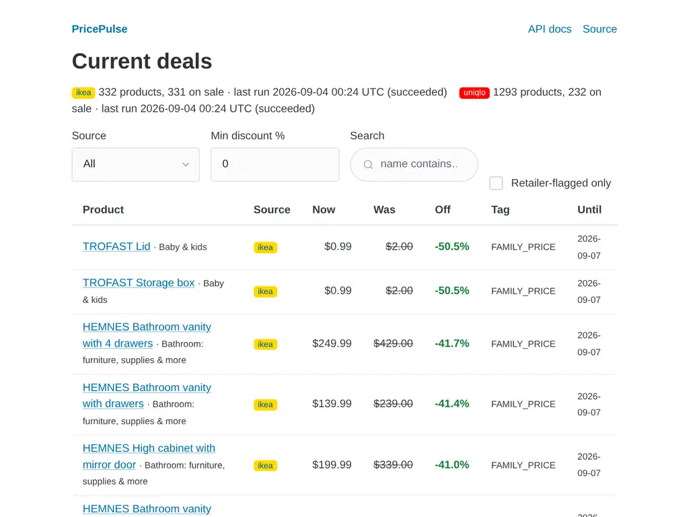
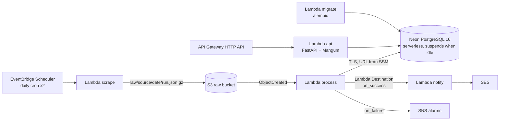
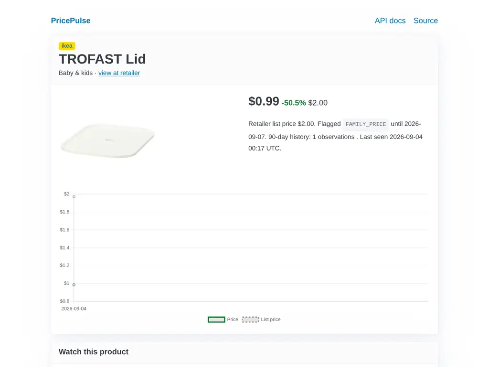

# PricePulse

Tracks every IKEA US offer and the full UNIQLO US catalog once a day, stores the price history in
PostgreSQL, detects sales two ways (what the retailer flags *and* what the history shows), and
emails a digest. Built to demonstrate production-grade **FastAPI + PostgreSQL + AWS serverless**
engineering at a ~$0/month running cost.



## Architecture



- **No VPC, no NAT, no always-on database.** The database is Neon (serverless PostgreSQL,
  ≈ 0.5 s resume, $0); every function runs outside a VPC. Chosen after measuring Aurora
  Serverless v2's 5–15 s resume on the first deployment. ([ADR-0009](docs/adr/0009-neon-instead-of-aurora.md))
- **Least privilege, secrets out of code.** Three DB roles (`app_migrator` / `app_rw` / `app_ro`);
  DDL-ish needs of the app role go through `SECURITY DEFINER` helpers; each Lambda reads only its
  own connection URL from an SSM SecureString parameter. ([ADR-0004](docs/adr/0004-partitioning-and-materialized-summary.md))
- **Idempotent ETL.** Raw payloads are the source of truth (S3, gzip JSON). Processing is keyed
  on the object key: re-delivering an event is a no-op; a failed run can be retried.
- **PostgreSQL on purpose.** DynamoDB would be cheaper and simpler for this access pattern; the comparison and why Postgres still wins for this project are in [ADR-0008](docs/adr/0008-postgresql-not-dynamodb.md).
- **History-derived discounts.** UNIQLO never exposes the original price — only a `discount`
  flag — so `discount_pct` is computed against the 90-day mode of prior observations, uniformly for
  both retailers. ([ADR-0005](docs/adr/0005-history-derived-discount-and-single-db-role-for-api.md))

More: [architecture.md](docs/architecture.md) · [ADRs](docs/adr) · [skills matrix](docs/skills-matrix.md) · [runbook](docs/RUNBOOK.md)

## Run locally (no AWS needed)

```bash
cp .env.example .env
make up migrate            # Postgres 16 via docker compose on :5433, alembic upgrade head
uv run pricepulse run --source ikea     # scrape -> data/raw -> Postgres, prints alerts as JSON
uv run pricepulse run --source uniqlo
make serve                 # http://localhost:8000  (dashboard)  http://localhost:8000/docs (OpenAPI)
```

```bash
curl -s 'localhost:8000/v1/deals?min_discount=30&limit=3' | jq .
curl -s 'localhost:8000/v1/products/2/history?days=90' | jq .
curl -s -X POST localhost:8000/v1/watches -H 'X-API-Key: dev-key' -H 'content-type: application/json' \
     -d '{"product_id": 2, "email": "you@example.com", "min_discount_pct": 10}'
uv run pricepulse notify --key-json result.json --dry-run   # render the email digest
make lint test             # ruff + pytest (unit + Postgres integration)
```



## Deploy to AWS

Prerequisites: an AWS account, `aws login`, a [Neon](https://neon.com) account with a personal API
key exported as `NEON_API_KEY`, Terraform ≥ 1.10, `uv`, `psql`.

```bash
terraform -chdir=infra/bootstrap init && terraform -chdir=infra/bootstrap apply   # state bucket
scripts/build_lambda.sh                                                           # build/*.zip (arm64)
terraform -chdir=infra/envs/dev init -backend-config="bucket=$(terraform -chdir=infra/bootstrap output -raw state_bucket)"
terraform -chdir=infra/envs/dev apply          # edit infra/envs/dev/dev.auto.tfvars first
# click the SES verification email(s) and confirm the SNS subscription
scripts/bootstrap_db.sh                        # least-privilege DB roles via psql (one time)
aws lambda invoke --function-name pricepulse-dev-migrate --cli-binary-format raw-in-base64-out --payload '{}' /dev/stdout
aws lambda invoke --function-name pricepulse-dev-scrape  --cli-binary-format raw-in-base64-out --payload '{"source":"ikea"}' /dev/stdout
```

After that, GitHub Actions deploys `main` via OIDC (`AWS_DEPLOY_ROLE_ARN`, `TF_STATE_BUCKET` and
`NEON_API_KEY` repository secrets; the `dev` environment can require a reviewer).

## Cost

| Item | Monthly |
| --- | --- |
| Neon Free (PostgreSQL 16, 0.25 CU, suspends when idle; ≈ 15–20 of 100 included CU-hours) | $0 |
| Lambda, API Gateway, EventBridge Scheduler, S3, SES, SNS, SSM parameters | ≈ $0 (always-free allowances / sub-cent) |
| CloudWatch logs (14-day retention) + alarms | < $0.50 |
| NAT gateway, always-on database | **$0 — avoided by design** (would be ~$32 and ~$44) |

Measured before the move: Aurora Serverless v2 at 0–1 ACU cost ≈ $1–3/month and resumed in
5–15 s; Neon resumes in ≈ 0.5 s ([ADR-0009](docs/adr/0009-neon-instead-of-aurora.md)).
A $5 AWS Budget with 80 %/100 % notifications guards the account. `terraform destroy` removes
everything, the Neon project included.

## Data & ethics

Personal, non-commercial price tracking. The adapters respect `robots.txt` (UNIQLO's disallowed
filter parameters are never sent), identify themselves (`User-Agent: pricepulse/0.1`), run once a
day (~40 requests total), pause 500 ms between requests, retry only on 429/5xx, and store product
metadata + prices only — no images, reviews, or personal data. Details in [ADR-0007](docs/adr/0007-respecting-robots-and-rate-limits.md).

## What this project does not cover

Kubernetes/ECS, Redis/ElastiCache, Kafka/Kinesis streaming, Airflow/Step Functions orchestration,
dbt/Redshift/Athena warehousing. What I'd add next: an Athena table over the S3 raw bucket
(lakehouse queries over the same data) and a resource-scoped replacement for the deploy role's
`PowerUserAccess`.
