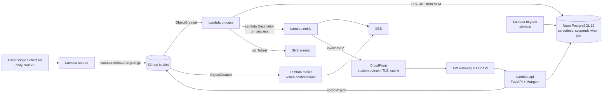

# PricePulse

**Live: [pricepulse.hoangmnguyen.com](https://pricepulse.hoangmnguyen.com)** · [API docs](https://pricepulse.hoangmnguyen.com/docs)

Tracks every IKEA US offer and the full UNIQLO US catalog once a day, stores the price history in
PostgreSQL, detects sales two ways (what the retailer flags *and* what the history shows), and
emails a digest. Anyone can watch a product (email double opt-in) and browse, sort, filter, and
share deal pages. Built to demonstrate production-grade **FastAPI + PostgreSQL + AWS serverless**
engineering; measured running cost ≈ $0.55/month.


## Architecture



- **No VPC, no NAT, no always-on database.** The database is Neon (serverless PostgreSQL,
  ≈ 0.5 s resume, $0); every function runs outside a VPC. Chosen after measuring Aurora
  Serverless v2's 5–15 s resume on the first deployment. ([ADR-0009](docs/adr/0009-neon-instead-of-aurora.md))
- **Least privilege, secrets out of code.** Three DB roles (`app_migrator` / `app_rw` / `app_ro`);
  DDL-ish needs of the app role go through `SECURITY DEFINER` helpers; each Lambda reads only its
  own connection URL from an SSM SecureString parameter. ([ADR-0004](docs/adr/0004-partitioning-and-materialized-summary.md))
- **Idempotent ETL.** Raw payloads are the source of truth (S3, gzip JSON). Processing is keyed
  on the object key: re-delivering an event is a no-op; a failed run can be retried.
- **PostgreSQL on purpose.** DynamoDB would be cheaper and simpler for this access pattern; the comparison and why Postgres still wins for this project are in [ADR-0008](docs/adr/0008-postgresql-not-dynamodb.md).
- **History-derived discounts.** UNIQLO never exposes the original price — only a `discount`
  flag — so `discount_pct` is computed against the 90-day mode of prior observations, uniformly for
  both retailers. ([ADR-0005](docs/adr/0005-history-derived-discount-and-single-db-role-for-api.md))
- **Cache in front, not a bigger database.** Pages set `Cache-Control: s-maxage=86400`; CloudFront
  serves them and `notify` invalidates `/*` after each run, so visitors almost never wake the
  database. Watch/confirm routes bypass the cache. ([ADR-0010](docs/adr/0010-public-watches-and-cdn.md))
- **Public watches, double opt-in.** `POST /v1/watches` needs no key: it writes an `outbox/` object,
  the `mailer` Lambda sends a confirmation, and only confirmed watches produce alerts. Every alert
  carries an unsubscribe link and a `List-Unsubscribe` header.

More: [architecture.md](docs/architecture.md) · [ADRs](docs/adr) · [skills matrix](docs/skills-matrix.md) · [runbook](docs/RUNBOOK.md)

## Run locally (no AWS needed)

```bash
cp .env.example .env
make up migrate            # Postgres 16 via docker compose on :5433, alembic upgrade head
uv run pricepulse run --source ikea     # scrape -> data/raw -> Postgres, prints alerts as JSON
uv run pricepulse run --source uniqlo
make serve                 # http://localhost:8000  (dashboard)  http://localhost:8000/docs (OpenAPI)
```

```bash
curl -s 'localhost:8000/v1/deals?min_discount=30&limit=3' | jq .
curl -s 'localhost:8000/v1/products/2/history?days=90' | jq .
curl -s 'localhost:8000/v1/deals?sort=savings&category=Storage%20%26%20organization&max_price=50' | jq .total
curl -s -X POST localhost:8000/v1/watches -H 'content-type: application/json' \
     -d '{"product_id": 2, "email": "you@example.com", "min_discount_pct": 10}'   # 202 -> data/raw/outbox/...
uv run pricepulse mailer --key outbox/watch_confirm/<date>/<id>.json --dry-run     # the confirmation email
uv run pricepulse notify --key-json result.json --dry-run   # render the email digest
make lint test             # ruff + pytest (unit + Postgres integration)
```


## Deploy to AWS

Prerequisites: an AWS account, `aws login`, a [Neon](https://neon.com) account (Free plan) with a
personal API key exported as `NEON_API_KEY` and its organization id in `dev.auto.tfvars`
(`neon_org_id`, from Organization settings), Terraform ≥ 1.10, `uv`, `psql`.

```bash
terraform -chdir=infra/bootstrap init && terraform -chdir=infra/bootstrap apply   # state bucket
scripts/build_lambda.sh                                                           # build/*.zip (arm64)
terraform -chdir=infra/envs/dev init -backend-config="bucket=$(terraform -chdir=infra/bootstrap output -raw state_bucket)"
terraform -chdir=infra/envs/dev apply          # edit infra/envs/dev/dev.auto.tfvars first
# click the SES verification email(s) and confirm the SNS subscription
scripts/bootstrap_db.sh                        # least-privilege DB roles via psql (one time)
aws lambda invoke --function-name pricepulse-dev-migrate --cli-binary-format raw-in-base64-out --payload '{}' /dev/stdout
aws lambda invoke --function-name pricepulse-dev-scrape  --cli-binary-format raw-in-base64-out --payload '{"source":"ikea"}' /dev/stdout
terraform -chdir=infra/envs/dev output site_url  # https://<distribution>.cloudfront.net
```

Optional custom domain, in two applies: set `domain_name = "pricepulse.example.com"` in
`dev.auto.tfvars` (a delegated subdomain works like an apex; add `hosted_zone_id` if the zone
already exists), `apply`, and create NS records for that name at the parent's DNS host from
`terraform output name_servers`. Once `dig NS pricepulse.example.com` answers, set
`domain_attached = true` and `apply` again: ACM validates through the zone and CloudFront gets the
alias. Until then `site_url` is the `*.cloudfront.net` hostname.

Email beyond your own verified addresses needs SES production access (otherwise the sandbox
rejects unverified recipients):

```bash
aws sesv2 put-account-details --production-access-enabled --mail-type TRANSACTIONAL \
  --website-url "$(terraform -chdir=infra/envs/dev output -raw site_url)" \
  --use-case-description "Personal price-tracking site; double opt-in watch confirmations and daily digests to confirmed subscribers; unsubscribe links in every email." \
  --additional-contact-email-addresses you@example.com --contact-language EN
```

(If the CLI rejects a flag, submit the same text through the SES console → Account dashboard →
Request production access. AWS answers within ~24 h.)

After that, GitHub Actions deploys `main` via OIDC (`AWS_DEPLOY_ROLE_ARN`, `TF_STATE_BUCKET` and
`NEON_API_KEY` repository secrets; the `dev` environment can require a reviewer). Dependabot keeps
Python, Terraform, and Actions dependencies current weekly.

## Cost

Estimated from the account's Cost Explorer and free-tier usage after the cutover (the account's
12-month free tiers have expired; only always-free allowances apply):

| Item | Basis | Monthly |
| --- | --- | --- |
| Route 53 hosted zone for the subdomain | $0.50/zone; alias queries to CloudFront are free | **$0.50** |
| API Gateway HTTP API | ~10k origin requests (cache misses + uncached routes) at $1/M | $0.01 |
| S3 raw + outbox | ~45 MB/month growth, 365-day retention, ≤ 0.5 GB at $0.023/GB | $0.01 |
| SES | ~60 digests + confirmations at $0.10/1k | $0.01 |
| Lambda | ~5k GB-s, ~15k invocations vs. always-free 400k GB-s / 1M | $0 |
| CloudFront + ACM | always-free 1 TB, 10M requests, 1,000 invalidation paths (≈ 60 used) | $0 |
| CloudWatch | 8 custom metrics / 6 alarms (10/10 free), ~50 MB logs (5 GB free) | $0 |
| EventBridge Scheduler, SNS, SSM + KMS, Budgets, data transfer | inside always-free allowances | $0 |
| Neon Free | ≈ 10–25 of 100 included CU-hours, 35 MB of 0.5 GB storage | $0 |
| **Total** | | **≈ $0.55** |

Before the move, Aurora Serverless v2 at 0–1 ACU alone cost ≈ $1–3/month and resumed in 5–15 s;
Neon resumes in ≈ 1 s ([ADR-0009](docs/adr/0009-neon-instead-of-aurora.md)). Cold path today:
Lambda init 2.5 s + first request ≈ 3 s; warm 0.1 s; CloudFront serves cached pages regardless.
A $5 AWS Budget with 80 %/100 % notifications guards the account. `terraform destroy` removes
everything, the Neon project included.

## Operating it

Everything an operator needs is in [docs/RUNBOOK.md](docs/RUNBOOK.md): credentials layout, AWS
login, re-running a scrape or a failed key, watch administration, the CDN, SES, alarms, DNS
delegation (this deployment delegates `pricepulse.hoangmnguyen.com` from Porkbun to Route 53
through the Porkbun API), and tear-down.

## Data & ethics

Personal, non-commercial price tracking. The adapters respect `robots.txt` (UNIQLO's disallowed
filter parameters are never sent), identify themselves (`User-Agent: pricepulse/0.1`), run once a
day (~40 requests total), pause 500 ms between requests, retry only on 429/5xx, and store product
metadata + prices only — no images, reviews, or personal data. Details in [ADR-0007](docs/adr/0007-respecting-robots-and-rate-limits.md).

## What this project does not cover

Kubernetes/ECS, Redis/ElastiCache, Kafka/Kinesis streaming, Airflow/Step Functions orchestration,
dbt/Redshift/Athena warehousing. What I'd add next: an Athena table over the S3 raw bucket
(lakehouse queries over the same data) and a resource-scoped replacement for the deploy role's
`PowerUserAccess`.
